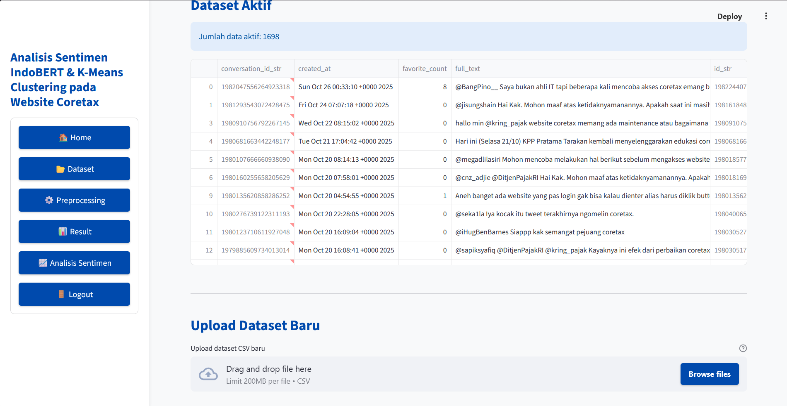
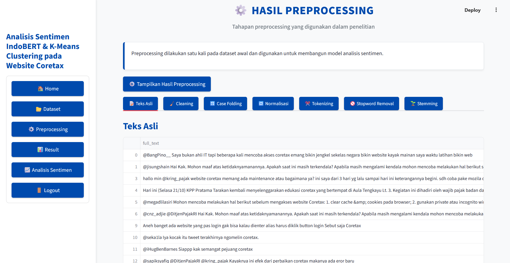
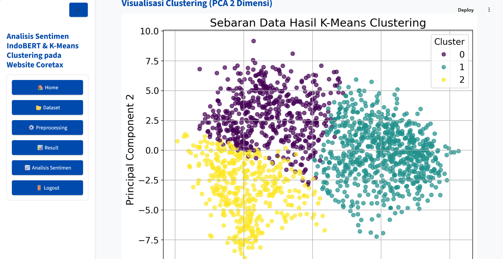
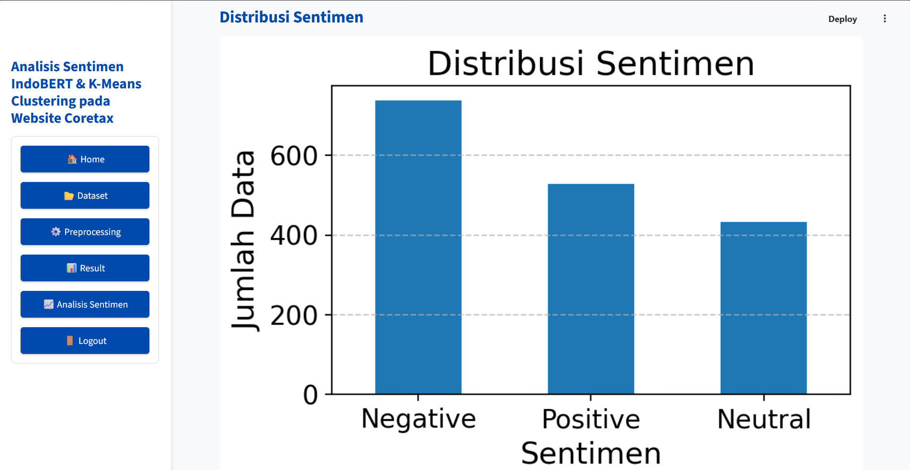
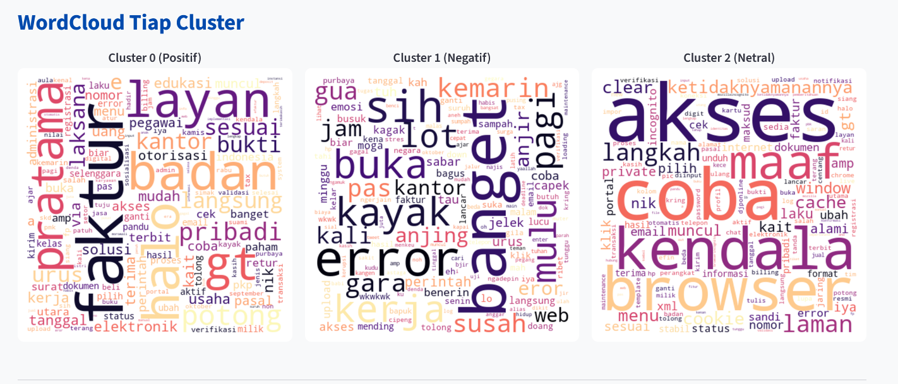
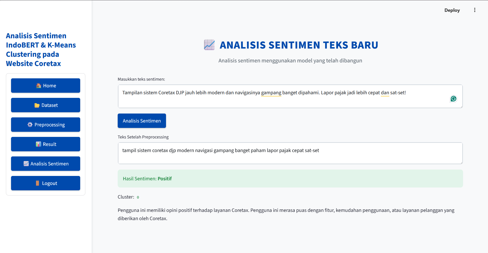

# Analisis Sentimen Data Media Sosial X pada Website Coretax Menggunakan K-Means Clustering dan IndoBERT

Repositori ini berisi aplikasi web berbasis **Streamlit** untuk menganalisis sentimen pengguna media sosial X (Twitter) terkait implementasi website Coretax. Project ini memanfaatkan **IndoBERT** untuk ekstraksi fitur (*word embedding*) dan **K-Means Clustering** untuk pengelompokan sentimen menjadi 3 kategori: Positif, Negatif, dan Netral.

## 🚀 Fitur Utama
* **Preprocessing Data Otomatis**: Meliputi data cleaning, normalisasi bahasa gaul (menggunakan kamus kata baku), *stopword removal* (Sastrawi/NLTK), dan *stemming*.
* **IndoBERT Embedding**: Representasi teks berbasis konteks yang akurat menggunakan model `indobenchmark/indobert-base-p1`.
* **Analisis Sentimen Real-time**: Masukkan teks tweet apa saja dan sistem langsung memprediksi sentimen serta memberikan deskripsi insight-nya.
* **Visualisasi Data**: Menampilkan hasil clustering berbasis PCA (2D) dan visualisasi kata dominan (*WordCloud*).

---

## 🛠️ Cara Menjalankan Aplikasi di Lokal

### 1. Kloning Repositori
```bash
git clone [https://github.com/username/analisis-sentimen-coretax.git](https://github.com/username/analisis-sentimen-coretax.git)
cd analisis-sentimen-coretax
```

### 2. Buat Virtual Environment & Aktifkan
* **Windows:**
```bash
python -m venv venv
venv\Scripts\activate
```

* **Mac/Linux:**
```bash
python3 -m venv venv
source venv/bin/activate
```

### 3. Install Dependensi
```bash
pip install -r requirements.txt
```

### 4. Jalankan Aplikasi Streamlit
```bash
streamlit run app.py
```

---

## Visualisasi Data

<details>
  <summary><b>1. Halaman Manajemen Dataset & Preprocessing (Klik untuk melihat)</b></summary>
  <br>
  <p align="center">
    
    <br><i>Tampilan dataset aktif dan preview upload data baru</i>
  </p>
  <p align="center">
    
    <br><i>Hasil pengujian tiap tahapan teks dari cleaning hingga stemming</i>
  </p>
</details>

<details>
  <summary><b>2. Halaman Hasil Clustering & Evaluasi (Klik untuk melihat)</b></summary>
  <br>
  <p align="center">
    
    <br><i>Grafik sebaran PCA 2D</i>
  </p>
  <p align="center">
    
    <br><i>Distribusi Sentimen dan Sentimen yang paling dominan</i>
  </p>
  <p align="center">
    
    <br><i>Kata kata yang paling sering muncul pada setiap sentimen</i>
  </p>
</details>

<details>
  <summary><b>3. Halaman Pengujian Sentimen Teks Baru (Klik untuk melihat)</b></summary>
  <br>
  <p align="center">
    
    <br><i>Prediksi sentimen realtime menggunakan model IndoBERT & K-Means</i>
  </p>
</details>